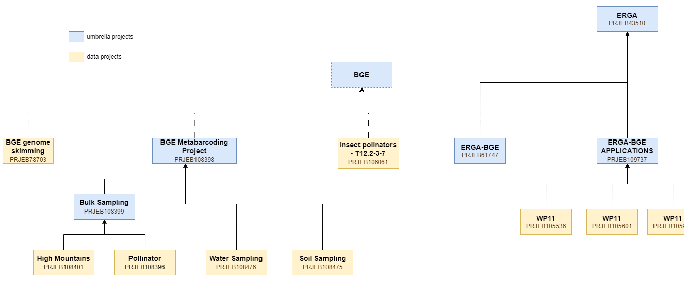
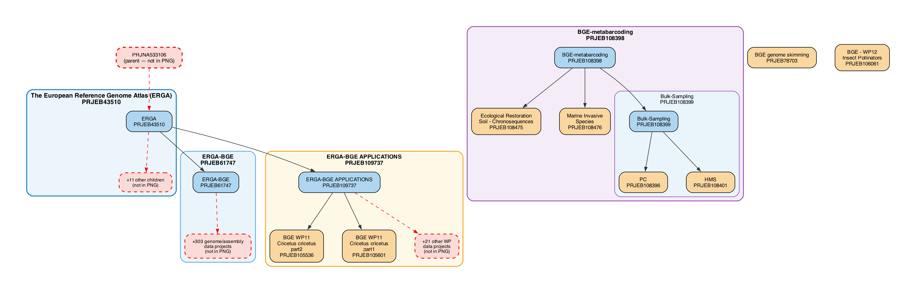

# ENA Umbrella Project Relationship Tools

A small Python toolkit for querying, validating, and visualising parent–child project hierarchies in the [European Nucleotide Archive (ENA)](https://www.ebi.ac.uk/ena).

Given a hand-drawn diagram of known ENA project accessions, these tools answer the question: **is the diagram complete?** Are there registered child or parent projects that the diagram does not show?

---

## Background

ENA organises sequencing projects into a hierarchy of **umbrella projects** (containers) and **data projects** (leaf nodes holding actual sequencing data). Large initiatives such as [ERGA](https://www.erga-biodiversity.eu/) and [BGE](https://biodiversitygenomics.eu/) span dozens — sometimes hundreds — of child projects across multiple umbrella layers.

The starting point for this workflow was the diagram below, which captures the intended hierarchy with accession numbers annotated on each node. Blue boxes are umbrella projects; yellow boxes are data projects. Dashed lines indicate relationships that do not yet exist in ENA — in this case the **BGE umbrella project**, which had not been created at time of analysis.



---

## How it works

The ENA Browser XML API exposes `<CHILD_PROJECT>` and `<PARENT_PROJECT>` elements for every project accession:

```bash
curl "https://www.ebi.ac.uk/ena/browser/api/xml/PRJEB43510"
```

```xml
<RELATED_PROJECTS>
  <RELATED_PROJECT>
    <CHILD_PROJECT accession="PRJEB109737"/>
  </RELATED_PROJECT>
  <RELATED_PROJECT>
    <PARENT_PROJECT accession="PRJNA533106"/>
  </RELATED_PROJECT>
</RELATED_PROJECTS>
```

Querying each known accession once is sufficient to surface all immediate neighbours. The crawler fetches **only the seed accessions** from the input diagram — neighbours outside this set are reported as missing but never themselves queried, preventing an unbounded cascade through ENA's full project graph.

### Pipeline

```
input_schema.png  →  ena_project_crawler.py  →  ena_relationships.json  →  ena_graph_generator.py  →  ena_graph.png
```

---

## Requirements

- Python 3.8+ (no external packages — standard library only)
- [Graphviz](https://graphviz.org/) for rendering the graph

```bash
brew install graphviz   # macOS
apt install graphviz    # Debian/Ubuntu
```

---

## Usage

**Step 1 — crawl ENA for relationships:**

```bash
python ena_project_crawler.py
```

Edit the `KNOWN_FROM_PNG` set at the top of the script to match your own accession list. Produces three output files: `ena_relationships.json` (full graph data), `ena_missing_from_diagram.txt` (human-readable completeness report), and `ena_graph.dot` (Graphviz source).

**Step 2 — generate the graph:**

```bash
python ena_graph_generator.py
```

Options:

| Flag | Default | Description |
|------|---------|-------------|
| `--json` | `ena_relationships.json` | Path to crawler output |
| `--svg` | off | Render as SVG instead of PNG (recommended for large graphs) |
| `--dpi` | `150` | Resolution for PNG output |

```bash
# SVG output — scales infinitely, best for large graphs
python ena_graph_generator.py --svg

# Custom input path and higher resolution
python ena_graph_generator.py --json path/to/ena_relationships.json --dpi 300
```

---

## Example output

The graph below was generated from the 13 seed accessions in the input diagram. Nodes and edges shown in **red dashed** lines were not present in the original diagram.



Key findings from this run:

- **PRJNA533106** (Earth BioGenome Project) is a registered parent of ERGA — absent from the input diagram
- **ERGA-BGE (PRJEB61747)** has 303 registered data children beyond the 2 shown in the diagram
- **ERGA-BGE APPLICATIONS (PRJEB109737)** has 21 additional child projects not in the diagram
- **PRJEB78703** and **PRJEB106061** are parentless — confirming the BGE umbrella project is indeed missing from ENA

---

## Output files

All generated files are saved to the [`output/`](output/) folder:

| File | Description |
|------|-------------|
| [`output/ena_relationships.json`](output/ena_relationships.json) | Full graph data — projects, edges, missing neighbours |
| [`output/ena_missing_from_diagram.txt`](output/ena_missing_from_diagram.txt) | Human-readable report of accessions and edges absent from the input diagram |
| [`output/ena_graph.dot`](output/ena_graph.dot) | Graphviz DOT source — re-render at any resolution or format |
| [`output/ena_graph.png`](output/ena_graph.png) | Rendered output graph |

To re-render the DOT file manually:

```bash
dot -Tsvg output/ena_graph.dot -o output/ena_graph.svg
dot -Tpng -Gdpi=300 output/ena_graph.dot -o output/ena_graph.png
```

---

## Repository structure

```
.
├── README.md
├── index.html                  # GitHub Pages documentation site
├── input_schema.png            # Input diagram (seed accessions)
├── ena_project_crawler.py      # Step 1: query ENA API, build JSON
├── ena_graph_generator.py      # Step 2: render JSON to graph
└── output/
    ├── ena_relationships.json      # Crawler output — graph data
    ├── ena_missing_from_diagram.txt  # Human-readable completeness report
    ├── ena_graph.dot               # Graphviz DOT source
    └── ena_graph.png               # Rendered output graph
```

---

## Notes

- The `<CHILD_PROJECT>` / `<PARENT_PROJECT>` tag names in the ENA XML differ from some older documentation which suggests `<IS_CHILD>` / `<IS_PARENT>` — the scripts use the correct names as verified against the live API.
- For projects with very large numbers of children (PRJEB61747 has 303+), the graph generator collapses unknown children into a single summary node per parent to keep the output readable.
- [view this document as html.](https://htmlpreview.github.io/?https://github.com/naturalis/BGE_relations_ENA/blob/main/index.html)
